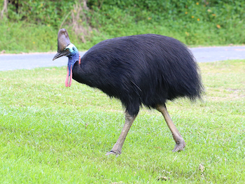

# Birds

<<<<<<< HEAD
*Birds are a group of warm-blooded vertebrates characterised by feathers*, the laying of hard-shelled eggs, a high metabolic rate, a four-chambered heart, and a strong yet lightweight skeleton. They are also characterised by toothless beaked jaws, however some species do have an egg tooth, which is a temporary, sharp projection present on the bill or snout of an oviparous animal at hatching. It allows the hatchling to penetrate the eggshell from inside and break free.
=======
**Birds are a group of warm-blooded vertebrates characterised by feathers**, the laying of hard-shelled eggs, a high metabolic rate, a four-chambered heart, and a strong yet lightweight skeleton. They are also characterised by toothless beaked jaws, however some species do have an egg tooth, which is a temporary, sharp projection present on the bill or snout of an oviparous animal at hatching. It allows the hatchling to penetrate the eggshell from inside and break free.
>>>>>>> 900fdadea7a0f4913a19f9c1e418e57d89962d77

## See Also

 - [Animal track](https://en.wikipedia.org/wiki/Animal_track)
 - [Avian sleep](https://en.wikipedia.org/wiki/Avian_sleep)
 - [Bat](https://en.wikipedia.org/wiki/Bat)
 - [Climate change and birds](https://en.wikipedia.org/wiki/Climate_change_and_birds)
 - [Glossary of bird terms](https://en.wikipedia.org/wiki/Glossary_of_bird_terms)
 - [List of individual birds](https://en.wikipedia.org/wiki/List_of_individual_birds)
 - [Ornithology](https://en.wikipedia.org/wiki/Ornithology)
 - 
 
[Paleocene dinosaurs](https://en.wikipedia.org/wiki/Dinosaur#Possible_Paleocene_survivors)

### Attribution
[Bird Wiki](https://en.wikipedia.org/wiki/Bird)
 - [Cassowary Image](https://en.wikipedia.org/wiki/Cassowary#/media/File:Southern_Cassowary_7071.jpg) By [Summerdrought](https://commons.wikimedia.org/wiki/User:Summerdrought)